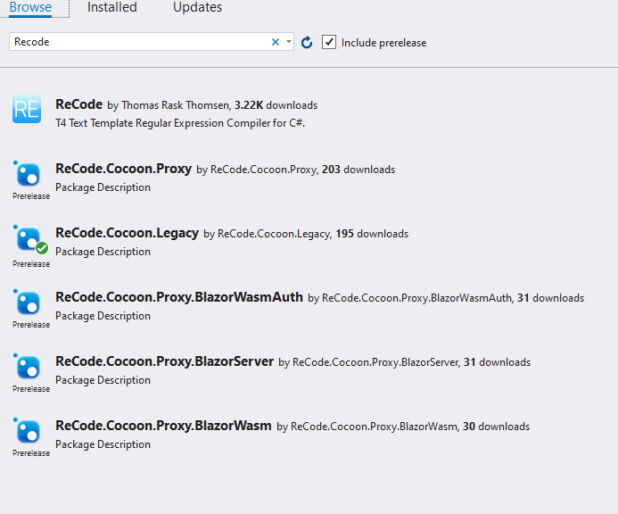

# Cocoon
An implementation of the Strangler Fig pattern for ASP.NET Core

## Using cocoon with fullframework MVC.

### Install the legacy nuget package


### Amend the web.config to load the handlers

```xml
<system.webServer>
    <handlers>
        <add name="FacadeSession" verb="*" path="facadesession" type="ReCode.Cocoon.Legacy.Session.SessionApiHandler, ReCode.Cocoon.Legacy, Version=1.0.0.0, Culture=neutral"  preCondition="integratedMode"/>
        <add name="FacadeCookies" verb="*" path="facadecookies" type="ReCode.Cocoon.Legacy.Cookies.CookieApiHandler, ReCode.Cocoon.Legacy, Version=1.0.0.0, Culture=neutral" preCondition="integratedMode"/>
        <add name="FacadeAuth" verb="*" path="facadeauth" type="ReCode.Cocoon.Legacy.Auth.AuthApiHandler, ReCode.Cocoon.Legacy, Version=1.0.0.0, Culture=neutral" preCondition="integratedMode"/>
    </handlers>
</system.webServer>
```

### Amend `Startup.Auth.cs`

In the file `/App_Start/Startup.Auth.cs`, add delegate to the `OnApplyRedirect` property that supresses the redirect to the login URL for `/facadeauth` requests.
```c#
app.UseCookieAuthentication(new CookieAuthenticationOptions
{
    AuthenticationType = DefaultAuthenticationTypes.ApplicationCookie,
    LoginPath = new PathString("/Account/Login"),
    Provider = new CookieAuthenticationProvider
    {
        OnApplyRedirect = context =>
        {
            /* This prevents the cookie auth model trying to redirect on a 401 */
            if(context.Request.Uri.ToString().Contains("facadeauth") && context.Response.StatusCode == 401)
            {
                return;
            }
                        
            context.Response.Redirect(context.RedirectUri);
        }
    }
});
```

### Disable MVC routing for the new handlers

```c#
public static void RegisterRoutes(RouteCollection routes)
{
    routes.IgnoreRoute("{resource}.axd/{*pathInfo}");
    routes.IgnoreRoute("favicon.ico");
    routes.IgnoreRoute("{*robotstxt}", new { robotstxt = @"(.*/)?robots.txt(/.*)?" });
    
    // Ignored routes for Cocoon 
    routes.IgnoreRoute("facadesession");
    routes.IgnoreRoute("facadeauth");
    routes.IgnoreRoute("facadecookies");
    // End ignored reoutes for Cocoon

    routes.MapMvcAttributeRoutes();
    AreaRegistration.RegisterAllAreas();

    routes.MapRoute(
        "Default", 
        "{controller}/{action}/{id}", 
        new { controller = "Home", action = "Index", id = UrlParameter.Optional },
        new[] { "TestApp.Controllers" });
}
```

### Check the session and auth cookie names are aligned between the applications

For authentication and session to work the names Cocoon uses between the applications must be aligned. In the new application look at the appSettings files.

```json
"Cocoon": {
    "Proxy": {
      "DestinationPrefix": "https://localhost:44302/"
    },
    "Authentication": {
      "BackendApiUrl": "https://localhost:44302/facadeauth",
      "LoginUrl": "/Account/Login?ReturnUrl={{ReturnUrl}}",
      "Cookies": [
        "AuthCookie"
      ]
    },
    "Session": {
      "BackendApiUrl": "https://localhost:44302/facadesession",
      "Cookies": [
        "ASP.NET_SessionId"
      ]
    },
    "Cookies": {
      "BackendApiUrl": "https://localhost:44302/facadecookies"
    }
  }
```

The cookie names need to match the names in the application that's being facaded. They can normally be found in the web.config

```xml
 <authentication mode="Forms">
    <forms loginUrl="~/Account/LogOn" timeout="432000" name="COOKIENAME" slidingExpiration="true" />
</authentication>
```

```xml
<system.web>
    <sessionState regenerateExpiredSessionId="false" cookieless="UseCookies" cookieName="COOKIENAME" />
</system.web>
```

# Integration testing

## Containers - Windows ##

Run the following from the terminal in the root of the project folder. e.g C:\Cocoon\

*Note : This will take some time to complete as it'll pull the windows server containers and build everyting required to run the legacy app and the modern app. After the initial build it'll be much quicker for future interations.*
```
docker-compose up

// Use the following if you want to rebuild the images

docker-compose up --build
```

If you want to build the images individually you can run the following from the root of cocoon:

```
docker build -t cocoon/blazorapp:latest -f samples/BlazorCocoon/Dockerfile .
docker build -t cocoon/mvccore:latest -f samples/mvccocoon/src/mvccocoon/Dockerfile .
docker build -t cocoon/blazorserver:latest -f samples/BlazorServerCocoon/src/BlazorServerCocoon/Dockerfile .
```
This is much quicker if you're amending individual applications.

Once running the following endpoints will now be available:

* http://localhost:5000 - Wasm
* http://localhost:5003 - MVC
* http://localhost:5005 - BlazorServer

## Running tests with playwrite

Install the CLI tooling.
```
dotnet tool install --global Microsoft.Playwright.CLI

// Install browser packages etc.

playwright install 
```
You can now run the tests inside the test/integration folder.
